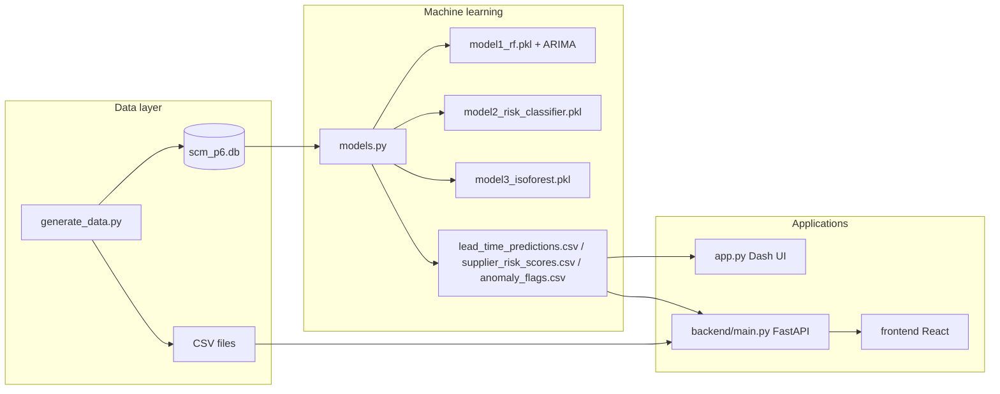

# SCME P6 — Supplier Relationship Management (SRM): Complete Study Report

This document is a single-place study guide for the mini project. It explains the business problem, every major component, every machine learning model and why it was chosen, the dataset (how it is built and why synthetic data is used), a working diagram of the system, key supply chain terms, and a viva section with questions and detailed answers.

---

## 1. What Problem Does This Project Solve?

Modern procurement and supplier management teams must balance cost, service level (on-time delivery), quality, and risk. This project implements a Supplier Relationship Management (SRM) analytics layer: it turns transactional data (purchase orders, receipts, inspections, communications, contracts) into KPIs, forecasts, risk labels, and anomaly alerts so planners can prioritize suppliers and investigate exceptions.

Course mapping: This aligns with SCME (Supply Chain Management for Engineers) Problem Statement P6 — an end-to-end SRM scenario with database design, analytics, and machine learning.

---

## 2. Supply Chain Terms You Should Use in the Viva

| Term | Meaning in this project |
|------|-------------------------|
| SRM (Supplier Relationship Management) | Processes and systems to select, onboard, evaluate, and collaborate with suppliers. |
| Procurement / sourcing | Placing purchase orders (POs) with suppliers for materials or services. |
| Lead time | Time from order date to actual delivery; critical for production scheduling and safety stock. |
| OTIF / on-time delivery | Share of orders where actual delivery ≤ expected delivery (SLA-aligned). |
| SLA (Service Level Agreement) | Contractual limits on lead time and defect rates; breaches trigger penalties or reviews. |
| Goods receipt (GR) | Confirmation that material arrived at the warehouse against a PO; ties to fulfillment (quantity received vs ordered). |
| Quality inspection | Post-receipt checks yielding defect rate (%) and pass/fail outcomes. |
| Supplier risk | Composite exposure from delays, quality, responsiveness, fulfillment, and contract posture. |
| Anomaly detection | Flagging unusual receipts (e.g., high defects + partial ship + odd timing) for root cause analysis. |
| Bullwhip / seasonality (context) | Data generator injects a Q3 seasonal spike in PO volume to mimic demand peaks. |
| SKU / category | Here, materials are grouped into categories: Raw Materials, Packaging, Electronics, Logistics, MRO. |

---

## 3. High-Level Architecture (How Everything Connects)

### 3.1 ASCII overview (quick mental model)

```
+------------------+     +-------------------+     +------------------+
| generate_data.py | --> | scm_p6.db (SQLite)| --> |    models.py     |
| + CSV exports    |     | 6 relational tbls   |     | 3 ML pipelines   |
+------------------+     +-------------------+     +--------+---------+
                                                           |
                         +----------------------------------+
                         v
              +----------------------+     +---------------------------+
              | ML outputs (CSV/PKL) | --> | app.py (Dash dashboard)   |
              | lead_time_predictions|     | 5 tabs, Plotly charts     |
              | supplier_risk_scores |     +---------------------------+
              | anomaly_flags        |              |
              | model_metrics.json   |              v
              +----------------------+     Optional: FastAPI + React
                                           backend/main.py + frontend/
```

### 3.2 Mermaid diagram (end-to-end data flow)



Reading the diagram: Synthetic data is generated once, stored in SQLite and CSVs. models.py reads the database, trains models, and writes predictions and metrics. The Dash app (`app.py`) loads DB + ML CSVs for the main demo. An optional FastAPI + React path serves JSON for a lighter UI.

---

## 4. All Components Used (Stack & Files)

### 4.1 Core Python pipeline

| File | Role |
|------|------|
| `generate_data.py` | Builds realistic synthetic master and transactional data using `faker`, `numpy`, `pandas`; writes 6 CSVs and `scm_p6.db`. |
| `schema.sql` | Declares SQLite tables: `Suppliers`, `PurchaseOrders`, `GoodsReceipts`, `QualityInspections`, `Communications`, `Contracts`. |
| `models.py` | Trains three ML workflows; saves `.pkl` models, charts (`feature_importance.png`, `anomaly_scatter.png`), CSV outputs, and `model_metrics.json`. |
| `app.py` | Plotly Dash server: multi-tab dashboard, global filters (date range, category), Plotly graphs, Dash Bootstrap Components styling. |

### 4.2 Data artifacts (inputs/outputs)

| Artifact | Description |
|----------|-------------|
| `scm_p6.db` | Single-file OLTP-style database for joins and consistent keys. |
| `*.csv` (root) | Portable snapshots of each table + ML outputs; used by Dash, FastAPI, and reporting. |
| `model1_rf.pkl`, `model1_arima_results.pkl` | Serialized Random Forest regressor and ARIMA result objects. |
| `model2_risk_classifier.pkl` | Serialized Random Forest classifier for risk labels. |
| `model3_isoforest.pkl` | Serialized Isolation Forest for receipt anomalies. |
| `model_metrics.json` | Aggregated RMSE, R², accuracy, F1, anomaly rate for documentation and API. |

### 4.3 Optional full-stack demo

| Path | Role |
|------|------|
| `backend/main.py` | FastAPI app: CORS-enabled REST endpoints (`/api/summary`, `/api/risk-suppliers`, `/api/anomalies`, `/api/leadtime-forecast`, `/api/model-metrics`). |
| `frontend/` (Vite + React) | Simple SPA calling the API; `App.jsx` fetches and displays KPIs and tables. |

### 4.4 Python libraries (from `requirements.txt`) and why they appear

| Library | Purpose in this project |
|---------|-------------------------|
| dash, dash-bootstrap-components | Web dashboard framework + Bootstrap-themed layout. |
| plotly | Interactive charts inside Dash (`dcc.Graph`). |
| pandas, numpy | Data frames, feature engineering, metrics. |
| scikit-learn | `RandomForestRegressor`, `RandomForestClassifier`, `IsolationForest`, `LinearRegression`, metrics, splits. |
| statsmodels | `ARIMA` for monthly lead-time series on top suppliers. |
| matplotlib, seaborn | Static plots for feature importance and anomaly scatter (saved as PNG). |
| faker | Realistic names, phones, emails in synthetic data. |
| fastapi, uvicorn | Optional REST API and ASGI server. |

---

## 5. Database Design (Entities & Relationships)

Logical model (SRM):

- Suppliers (master): one row per vendor; category, geography, payment terms (Net30/60/90), baseline price index for variance context, `is_active`.
- PurchaseOrders: line-level procurement facts — material, quantity, pricing, expected vs actual delivery, status (Pending / Delivered / Delayed / Cancelled).
- GoodsReceipts: warehouse GR against PO; received quantity and condition (Accepted / Partial / Rejected).
- QualityInspections: one inspection per receipt; defect_rate_pct, result, remarks.
- Communications: tickets/calls/emails; response_time_hours, resolved flag — proxy for supplier responsiveness.
- Contracts: value, SLA lead time, SLA defect limit, renewal_status, penalty text.

SQLite adds a generated column `delay_days` on `PurchaseOrders` (expected vs actual), which supports delay analytics without redundant storage.

---

## 6. The Dataset: What It Contains, Why It Was Created, and Why Synthetic

### 6.1 What gets generated (approximate scale)

Configured in `generate_data.py`:

- 30 suppliers across 5 categories (6 suppliers per category).
- 500 purchase orders from Jan 2023 to Mar 2026.
- ~420 communications, 30 contracts, and derived goods receipts (one per delivered/delayed PO) plus quality inspections.

### 6.2 Why the dataset was created (rather than only downloading public data)

1. Privacy and compliance: Real supplier ERP extracts contain PII, pricing, and contract terms that cannot be shared in academic submissions.
2. Controlled ground truth: The generator encodes known “bad” suppliers (`BAD_SUPPLIERS`), good suppliers, and an improving supplier so that risk models and anomaly detectors have explainable patterns to discover.
3. Schema fit: Tables match exactly the course ERD and assignment queries (PO → GR → inspection chain).
4. Reproducibility: `random.seed(42)` and `Faker.seed(42)` make runs repeatable for grading and demos.
5. Edge cases on purpose: Seasonal Q3 PO spike, raw material price drift, partial shipments, inactive supplier, contracts expiring near the project “as-of” date (April 2026 context in `app.py`).

### 6.3 Behavioral realism (how “physics” is injected)

- Bad suppliers: Higher delay probability, longer delays, high defect ranges, slower response times, more unresolved comms, sometimes expired contracts.
- Good suppliers: Low delay probability, low defects, fast responses.
- Improving supplier (SUP010): Defect rate and delay probability improve over time — useful for discussing continuous improvement and time-varying performance.
- Seasonality: More POs in Jul–Sep to simulate a busy quarter (planning stress).

This is synthetic but structured data: it is ideal for learning, not for claiming real-world benchmark performance.

---

## 7. Machine Learning Models — Full Detail

All training logic lives in `models.py`. The pipeline assumes `generate_data.py` has been run so `scm_p6.db` exists.

### 7.1 Model 1 — Lead time forecasting (regression + time series)

Business question: “Given supplier, category, order size, price, calendar features, and historical supplier behavior, how many days will this PO take to deliver?”

Why it matters: Accurate lead times drive MRP scheduling, safety stock decisions, and promised dates to internal customers.

Features (high level):

- Encoded supplier ID, quantity, unit price, month/quarter.
- Expected lead time (from order to promised date).
- Historical average lead time and historical delay rate per supplier (rolling behavior).

Algorithms:

1. Linear regression — simple baseline; interpretable; compares RMSE/R² against tree model.
2. Random Forest Regressor (`n_estimators=300`, `max_depth=12`, …) — captures nonlinear interactions (e.g., category × supplier).
3. ARIMA(2,1,2) on monthly average lead time for the top 5 suppliers by PO count — produces 3-month-ahead point forecasts and 95% confidence intervals, saved to `lead_time_predictions.csv` and `model1_arima_results.pkl`.

Why Random Forest: Strong default for tabular mixed numeric/categorical data with nonlinearities; feature importance is exported to `feature_importance.png` for interpretation.

Why ARIMA: Classical univariate time series method for trend/seasonality in monthly aggregates; complements cross-sectional RF (different question: supplier-specific temporal drift).

Sample metrics (from `model_metrics.json`):

- Linear Regression: RMSE ≈ 3.67, R² ≈ 0.73
- Random Forest: RMSE ≈ 3.85, MAE ≈ 2.85 days, R² ≈ 0.70
- Training rows: 449 completed POs

Interpretation: Both models achieve moderate-to-strong R² on this synthetic setup; RF is not strictly lower RMSE here — acceptable in coursework if you explain variance in small data and different splits.

---

### 7.2 Model 2 — Supplier risk scoring (classification)

Business question: “Which suppliers are Low / Medium / High risk given operational KPIs?”

Why it matters: Supports segmentation (e.g., audit high-risk monthly), dual sourcing, and negotiation using data.

Feature engineering (per supplier):

- On-time rate, average lead time, lead time variance (variability is operational risk).
- SLA breach count (late vs promised).
- Average defect rate from inspections.
- Average response time from resolved communications.
- PO fulfillment rate from received vs ordered quantities.
- Contract compliance proxy (active contract flag).

Labels: Rule-derived `risk_label` from thresholds on on-time %, defects, SLA breaches — then the Random Forest Classifier learns to predict the same pattern from features (useful when rules are a stand-in for SME judgment).

Risk score: A weighted linear composite (0–100) combining on-time, inverse defect penalty, responsiveness, fulfillment — displayed alongside ML predicted_label.

Why Random Forest Classifier: Handles mixed signals, nonlinear boundaries between Low/Medium/High; stratified split preserves class balance.

Sample metrics: Accuracy ≈ 83.3%, weighted F1 ≈ 0.815, 29 active suppliers scored.

---

### 7.3 Model 3 — Anomaly detection on goods receipts

Business question: “Which goods receipts look unusual in defect rate, fulfillment, delay, and price-vs-baseline — warranting investigation?”

Why it matters: In operations, exceptions drive CAPA (corrective/preventive action), claims, and supplier reviews.

Features:

- `defect_rate_pct`
- `fulfillment_ratio` (received / ordered)
- `delivery_delay_days` (receipt date vs expected delivery)
- `unit_price_vs_baseline` (price stress vs supplier baseline index)

Algorithm: Isolation Forest (`contamination=0.05`) — unsupervised; flags ~5% as anomalies (`is_anomaly=1`). Anomaly score is derived from the negative decision function (higher = more anomalous).

Why Isolation Forest: Works well in moderate dimensions, robust to outliers, no labels required — fits exception-based SCM monitoring.

Sample metrics: 449 receipts, 23 anomalies (~5.12%).

Visualization: `anomaly_scatter.png` plots delay vs defect rate with normal vs anomaly points.

---

## 8. The Interactive Dashboard (`app.py`)

Framework: Plotly Dash + Dash Bootstrap Components (theme: FLATLY).

Global filters: Date range and material category (or All).

Five tabs:

1. Executive Overview — Portfolio KPIs (e.g., spend, delays, risk distribution).
2. Supplier Scorecard — Comparative supplier performance.
3. Lead Time & Forecasting — RF insights + ARIMA forecast visualization where implemented.
4. Quality & Goods Receipts — Defects, GR conditions, linkage to anomaly_flags.csv.
5. Communications & Contracts — Response times, renewal/expiry themes.

Reference “today” in app: `TODAY = datetime(2026, 4, 9)` for consistent “current” reporting in the demo.

---

## 9. How to Run the Project (Exam-Ready Order)

1. Create venv, `pip install -r requirements.txt`.
2. `python generate_data.py` — creates DB + CSVs.
3. `python models.py` — trains models and writes ML outputs + `model_metrics.json`.
4. `python app.py` — open http://127.0.0.1:8050.

Optional: `uvicorn backend.main:app --reload --port 8000` and `npm run dev` in `frontend/` for the React view.

---

## 10. Viva Questions and Detailed Answers

### A. Project scope and domain

Q1. What is SRM and what does your project automate?  
A. SRM is the discipline of managing supplier lifecycle and performance. This project automates measurement (KPIs from PO/GR/quality/comms/contracts), prediction (lead time), risk classification, and anomaly flagging — supporting data-driven procurement and quality decisions.

Q2. What is lead time and why forecast it?  
A. Lead time is the order-to-delivery duration. Forecasting supports production planning, inventory optimization, and credible commit dates to downstream operations.

Q3. What is OTIF / on-time delivery?  
A. It is the fraction of orders delivered on or before the committed expected delivery date. It is a core service level metric in procurement SLAs.

---

### B. Database and data generation

Q4. Why SQLite?  
A. Serverless, file-based, sufficient for prototype analytics and coursework; SQL skills transfer to enterprise DBs. Foreign keys model referential integrity between PO, GR, and inspections.

Q5. Why synthetic data instead of real company data?  
A. Confidentiality, no GDPR/contract issues, full control of scenarios (bad/good/improving suppliers), and reproducible demos for evaluation.

Q6. What does `baseline_price_index` do?  
A. It is a reference for each supplier so we can compute price variance vs baseline — useful in anomaly features and cost discussions.

Q7. Explain PO → GR → Quality Inspection flow.  
A. A PO authorizes supply. On delivery, a goods receipt records quantity and condition. Quality inspection samples/measures the lot and records defect_rate_pct and pass/fail — closing the procure-to-pay loop for quality accountability.

---

### C. Machine learning

Q8. Why Random Forest for lead time?  
A. It models nonlinear relationships and interactions between supplier, category, and volumes; provides feature importance for explanation.

Q9. Why did you keep Linear Regression?  
A. As a baseline for comparison (RMSE/R²). Baselines are standard practice to justify a more complex model.

Q10. What does ARIMA add that Random Forest does not?  
A. RF is mainly cross-sectional on PO-level rows. ARIMA models monthly time series per major supplier — useful for trend and short horizon forecasting of average lead time.

Q11. Why are risk labels rule-based before ML?  
A. Labels require supervision; rules encode domain logic transparently. The classifier then learns to generalize similar risk patterns from features — a practical approach when expert rules exist but may need scaling.

Q12. Why Isolation Forest for anomalies?  
A. It is unsupervised (no need for “fraud” labels), handles continuous features, and isolates rare multivariate combinations — aligned with exception management in supply chains.

Q13. What does `contamination=0.05` mean?  
A. It assumes roughly 5% of receipts are anomalous — a prior on rarity; matches typical “top few percent” exception monitoring.

Q14. Is accuracy enough for risk classification?  
A. Not alone. Mention class imbalance, confusion matrix, and F1; your project reports weighted F1 alongside accuracy.

Q15. How do you avoid data leakage in lead time features?  
A. Be careful in real systems: historical aggregates should use only past POs relative to each order. This academic pipeline uses simplified group statistics — in viva, acknowledge leakage as a refinement for production (time-based splits).

---

### D. Dashboard and tech

Q16. What is Dash?  
A. A Python framework for reactive web apps; UI and callbacks live in Python; charts use Plotly.

Q17. What is the FastAPI + React part?  
A. An optional REST API + SPA demo showing how the same CSV outputs can power a decoupled front end — common in industry microservices.

---

### E. Limitations and improvements (strong viva closing)

Q18. What are limitations of this project?  
A. Synthetic data ≠ real supplier behavior; models are not deployed with MLOps (monitoring, drift, retraining); causal claims need careful language — we show association and prediction, not proven causation without experiments.

Q19. How would you improve it?  
A. Real ERP integration, time-based CV, explainability (SHAP), dashboard alerts tied to workflow (tickets), and multi-echelon inventory linkage.

---

## 11. One-Page “Memory Map” for Revision

- Data: 6 tables, synthetic but structured; SQLite + CSV.  
- ML: (1) RF + LR + ARIMA for lead time; (2) RF classifier for risk; (3) Isolation Forest for receipt anomalies.  
- App: Dash five-tab SRM dashboard; optional FastAPI/React.  
- Why: Faster decisions, visibility, and exception focus in the procurement–quality–contract triangle.

---

End of report. Regenerate ML metrics anytime by running `models.py` after data generation; numbers may differ slightly if code or random seeds change.
