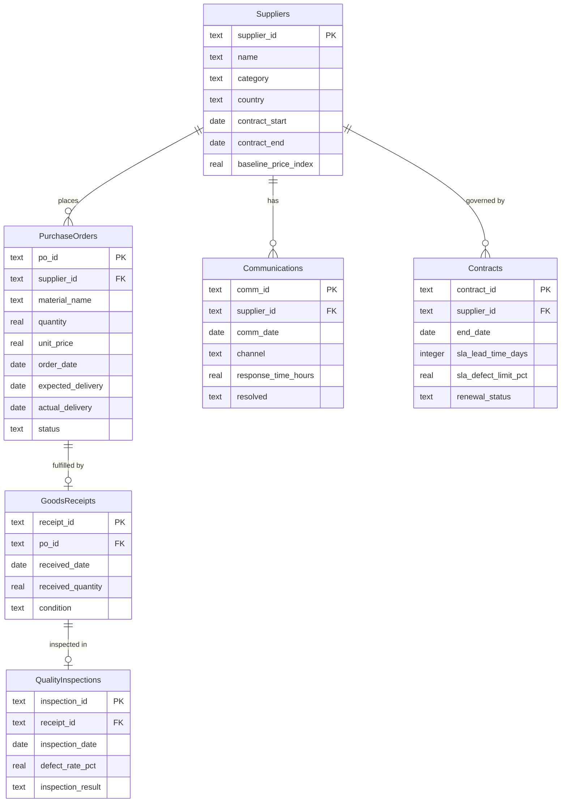

# Entity-Relationship Diagram — SCME P6 Supplier Relationship Management

## Table Relationships

| Relationship | Type | Description |
|---|---|---|
| Suppliers → PurchaseOrders | One-to-Many | Each supplier can have multiple purchase orders |
| Suppliers → Communications | One-to-Many | All communication records are linked to a supplier |
| Suppliers → Contracts | One-to-Many | Each supplier is governed by one or more contracts |
| PurchaseOrders → GoodsReceipts | One-to-One | Each delivered PO has one corresponding receipt |
| GoodsReceipts → QualityInspections | One-to-One | Each receipt undergoes one quality inspection |
